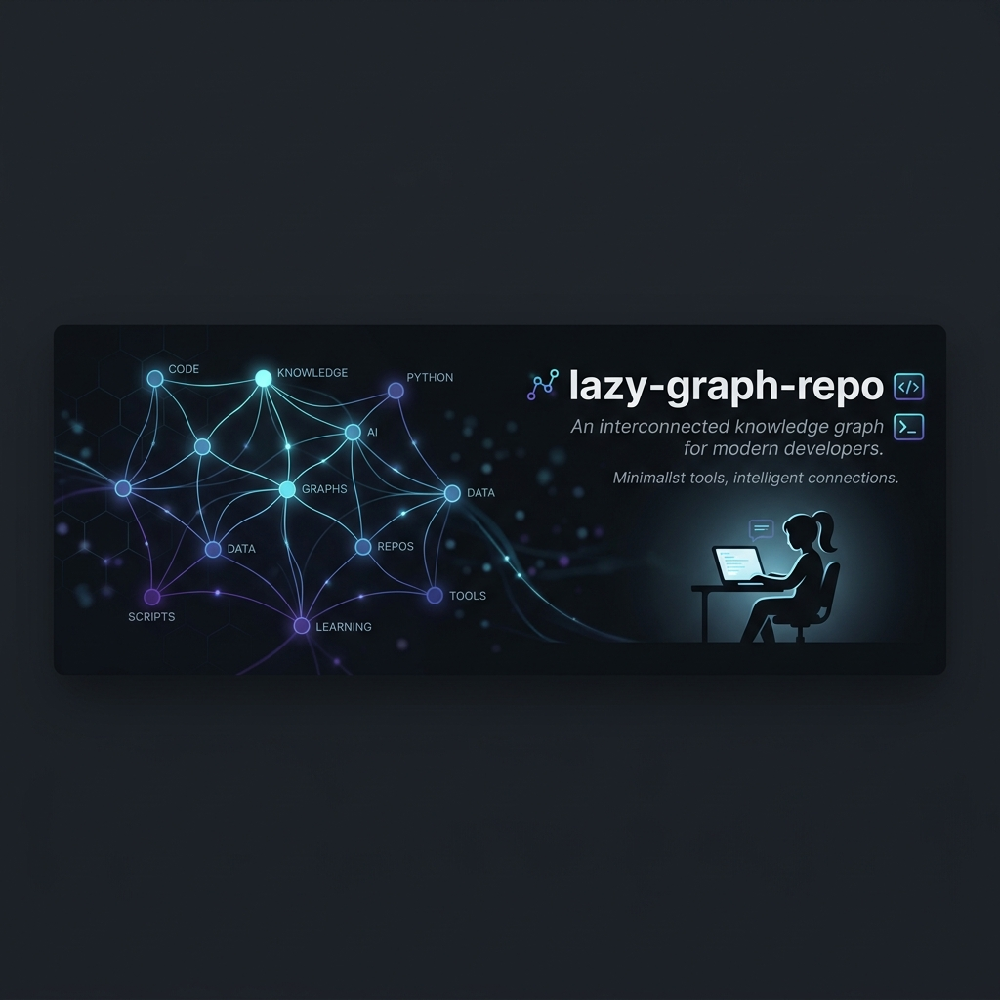

# LLM Wiki Manager (Antigravity Skill)



A prompt-engineering scaffold that turns any capable LLM into a maintainer of a persistent, interconnected markdown knowledge base — inspired by Andrej Karpathy's "LLM Wiki" idea. Features autonomous, unattended operations and robust artifact backup capabilities.

This repository has been refactored into a single **Skill** file compatible natively with Antigravity, and easily loadable into Claude Opus 4.6 or Gemini 3.1 Pro.

## What this is

A single instruction file (`SKILL.md`) that gives an agent a consistent persona, workflows, and output discipline for building a wiki over time.

**🔥 NEW: Ponytail Optimizations**
We recently implemented the "Lazy Senior Developer" optimizations from [DietrichGebert/ponytail](https://github.com/DietrichGebert/ponytail). This means that any project initialized with this wiki skill will automatically generate a `_ponytail_principles.md` file. This forces the agent to write highly optimized, minimal code (YAGNI, standard library first) while strictly preserving the integrity and tracking of the knowledge base.

This repo contains **no runtime code**. It is a declarative prompt instruction set.

## Layout

```
SKILL.md                         # The master instruction set (Persona + Workflows)
wiki/                            # The knowledge base itself (markdown)
  index.md                       # Entry point + topic map
```

## Usage with Antigravity

You can let Antigravity install this skill for you automatically! 

1. Open [INSTALL_GUIDE.md](file:///home/damirl/Desktop/LLM%20wiki%20system/INSTALL_GUIDE.md).
2. Copy the prompt provided inside and send it to your new Antigravity session.
3. Antigravity will create the folders, write the plugin files, and register it.
4. Once registered, drop raw notes / URLs / paste into chat — the agent will run the ingestion workflow.
5. Periodically ask it to "lint the wiki" to dedupe, link orphans, and resolve contradictions.
6. Periodically ask it to "backup artifacts" to save generated plans or session text into `wiki/artifacts/`.
7. **Note:** The agent is configured for Unattended Operations and will execute linting/ingestion workflows autonomously without step-by-step approvals.

## Usage with Web UIs (Gemini / Claude)

1. Open `SKILL.md`.
2. Copy the entire file contents.
3. Paste it directly into the "System Instructions" or "Custom Instructions" section of your LLM platform. (The YAML header at the top is fine, the LLM will ignore it or read it as context).
4. Begin chatting with your AI assistant in your workspace.

## Conventions Enforced by the Skill

- **Link syntax:** standard markdown only — `[Title](relative/path.md)`. No `[[wikilinks]]`.
- **Page format:** YAML frontmatter + markdown body.
- **Wiki root:** all knowledge pages live under `wiki/`.
- **Provenance:** every page MUST end with a `## Sources` section listing origin documents with access dates.

## License

MIT — see `LICENSE`.
